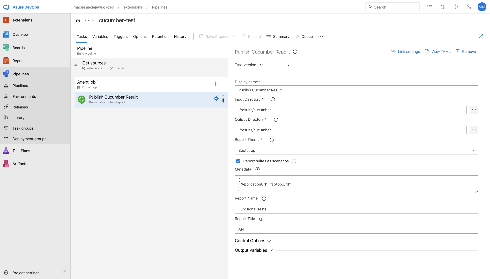
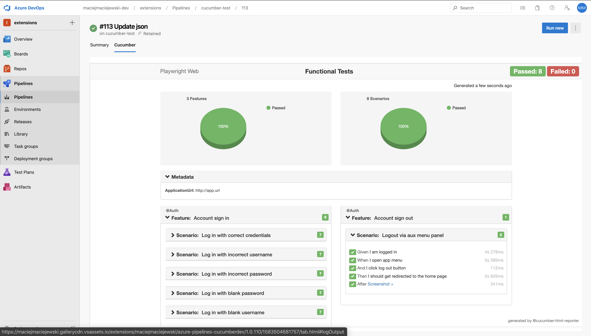

# Azure Pipelines Cucumber Reporter

Azure DevOps extension that provides a task for publishing Cucumber report in a HTML format and embeds it into a Build and Release pages.

## Configuration

This extension reads Cucumber run report saved in JSON format. In order to get such file one needs to set up formater in Cucumber runner as following.

```
--format=json:./results/cucumber.json
```

Once the file is saved it can be useda as an input to the Publish task.

### Parameters

`Input directory` - path where looks for JSON files and then combines them into single report

`Output directory` - path where task saves outpu HTML report

`Metadata` - optional custom metadata in JSON format that is added to the report

`Theme` - theme used for the report

`Name` - optional name of the report

`Title` - optional title of the report

### Example YAML setup

```YAML
steps:
- task: MaciejMaciejewski.azure-pipelines-cucumber.PublishCucumberReport.PublishCucumberReport@1
  displayName: 'UploadCucumberReport '
  inputs:
    jsonDir: ./results/cucumber
    outputPath: ./results/cucumber
    metadata: |
     {
       "ApplicationUrl": "$(App.Url)"
     }
    name: 'Functional Tests'
    title: API
```

### Example GUI setup



### Example report on build tab



## Credits

For generating HTML report task uses  [cucumber-html-reporter](https://www.npmjs.com/package/cucumber-html-reporter)
